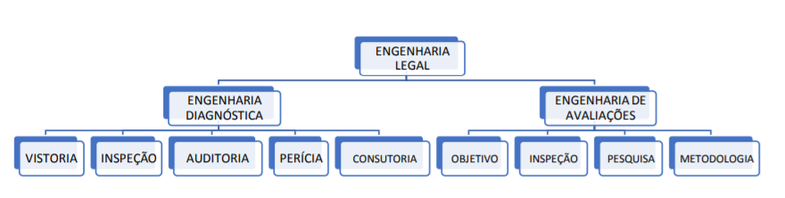
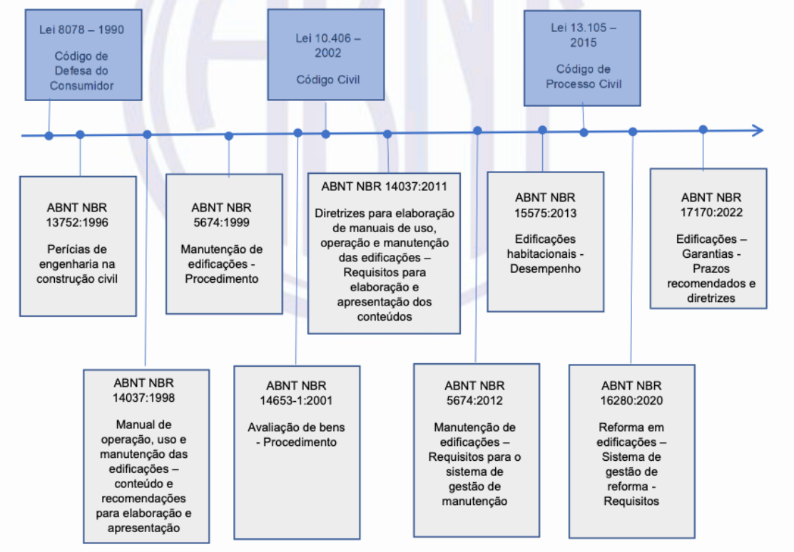
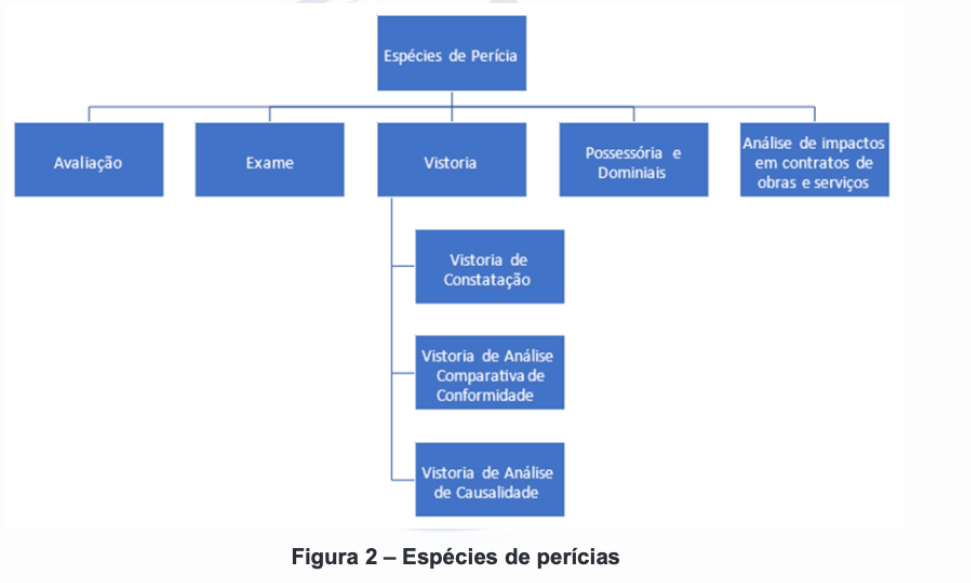
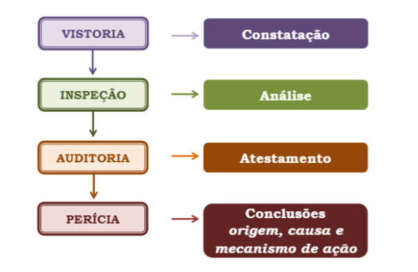

## Introdução

- **Processo Judicial**: instrumento utilizado para analisar e resolver 
conflitos, onde uma das partes busca o reconhecimento de um direito;

- Quando o julgamento depende de uma prova técnica ou científica específica, o 
juiz nomeia um auxiliar da justiça - o perito, ou "*expert*" - para apoiá-lo.

- O perito, escolhido entre profissionais legalmente habilitados, tem a 
responsabilidade de conduzir a perícia no prazo determinado, utilizando toda sua 
expertise. 

## Estrutura do Curso

- Sexta-Feira:
  - Introdução:
    - Perícias de Engenharia (conceituação, objetivo)
    - Engenharia Legal
    - Tipos de Perícias de Engenharia
    - Laudo
    - Quesitos
    - Normas Técnicas
    - Modelos de Petições e Laudos
  - Engenharia Diagnóstica

## Estrutura do Curso

- Sábado:
  - Perícias de Valor em Edificações
    - Método Evolutivo
    - Método da Quantificação do Custo
      - Tipos de Orçamento
      - Custo Unitário Básico
      - Área Equivalente
      - Custos extra-CUB
      - NBR 12.721/2006
      - Depreciação
      - Fator de Comercialização
      
  - Perícias de Custo

## Estrutura do Curso

- Domingo:
  - Avaliação
    - Elaboração de uma perícia completa, passando por:
      - Diagnóstico do problema
      - Solução técnica para reparo do problema
      - Quantificação do Custo dos reparos
      - Determinação do Valor de Mercado pelo Método Evolutivo
      
  
## Perícias de Engenharia

- Perícias estão previstas como **meios de prova** (Código Civil e Código de 
Processo Civil)

- São admitidas sempre que a comprovação do fato depender do conhecimento 
técnico ou científico (Código de Processo Civil, art. 145)

- **Perícia judicial**: "é toda verificação de fato ou fixação de valor, 
realizada em juízo e expressa em laudo, por pessoa compromissada no processo."

## Perícias de Engenharia {.smaller}

- Segundo @medeiros [p. 33]:

  - **Perícia**:
    - Atividade concernente a exame realizado por profissional especialista, 
    legalmente habilitado, destinada a verificar ou esclarecer determinado fato,
    apurar as causas motivadoras do mesmo, ou o estado, alegação de direitos ou a
    estimação da coisa que é objeto de litígio ou processo.
    
  - **Perito**:
    - Profissional legalmente habilitado, idôneo e especialista, convocado para
    realizar uma perícia.
    
  - **Assistente Técnico**:
    - Profissional legalmente habilitado, **indicado e contratado pela parte**
    para orientá-la, assistir aos trabalhos periciais em todas as fases da 
    perícia e, quando necessário, emitir seu **Parecer Técnico**
    
  - **Laudo**:
    - Parecer técnico escrito e fundamentado, emitir por um especialista indicado
    por autoridade, relatando resultados de exames e vistorias, assim como 
    eventuais avaliações com ele relacionadas.

## Objetivo da Perícia Judicial

- O objetivo da perícia judicial é a obtenção de juízo técnico especializado 
sobre questões de fato, de interesse para decisão de causa, destacando-se,
em particular, um tipo de perícia denominada *avaliação*, que tem por objetivo
a apuração do valor das coisas, direitos e obrigações, determinada pelo juiz,
de ofício ou a requerimento das partes [@meirelles, 385].

## Engenharia Legal

  
## Espécies de Perícias de Engenharia

- A perícia judicial apresenta-se sob três espécies bem distintas [@meirelles, p. 384]:
  - Exame
  - Vistoria
  - Avaliação
  
## Evolução da conceituação das perícias

## Espécies de Perícias de Engenharia

## Exame

- @meirelles [p.390-391]:
  - *Exame judicial* é espécie do gênero *perícia judicial* e se caracteriza 
  como inspeção feita em pessoas, animais ou bens móveis, para quaisquer
  verificações de interesse da Justiça, elaborada por perito nomeado pelo juiz
  para a verificação de fatos ou circunstâncias que interessem à solução da 
  causa.
  
- @NBR13752 [p. 10]:
  - Os requisitos para o exame dependem do objeto e de seu objetivo, sendo 
  necessária a adequação em relação à especificidade de cada caso.
  
- @meirelles [p.391]:
  - O Código processual, embora dando sentido específico a *exame* no art. 420,
  onde o distingue da *vistoria* e da *avaliação*, empresta-lhe o significado
  genérico de *perícia judicial* nos arts. 335, 846 e 851, numa gritante falta
  técnica. Deste modo, torna-se difícil conceituar o *exame* em face da norma
  adjetiva, que ora especifica e ora restringe, ora generaliza e alarga o seu
  significado, confundindo-o com as demais espécies.
  
## Vistoria

- @NBR13752 [p. 10]:
  - As vistorias são classificadas como de constatação, de análise comparativa
  de conformidade e de análise de causalidade, e os requisitos específicos para
  cada uma delas são apresentados em 7.3.3.1, 7.3.3.3 e 7.3.3.4. Adicionalmente
  são apresentados requisitos específicos para os seguintes casos particulares
  das modalidades de vistorias de constatação e de análise comparativa de
  conformidade:
    a. vistoria cautelar de vizinhança, conform 7.3.3.2
    b. vistoria de obras não concluídas, conforme 7.3.3.6
    c. vistoria de entrega e recebimento de obra, conforme 7.3.3.7
    
## Vistoria Cautelar de Vizinhança

- @NBR13752 [p. 11]:
  - A vistoria cautelar de vizinhança é uma modalidade de vistoria de constatação,
  que objetiva **perpetuar a memória**, visando:
    a. identificar anomalias, manifestações patológicas e falhas;
    b. caracterizar tipo, estado de conservação, padrão construtivo, idade ou
    outras características importantes em edificações e benfeitorias 
    predeterminadas, na área de influência da obra.

## Vistoria de análise comparativa de conformidade

- @NBR13752 [p. 12]:
  - Os requisitos que devem ser atendidos na vistoria de análise comparativa de
conformidade estão relacionados à comparação do objeto da perícia com os padrões
especificados.
  - Alguns dos requisitos utilizados estão vinculados, entre outros, aos 
  seguintes documentos:
    a. Projeto e memoriais descritivos;
    b. legislações pertinentes;
    c. normas técnicas;
    d. prospectos e informes publicitários;
    e. manuais de uso, operação e manutenção (áreas comuns e privativas);
    f. dados e catálogos técnicos de fabricantes.
    
## Vistoria de análise de causalidade

- @NBR13752 [p. 13]:
  - A vistoria de análise de causalidade, ou de apuração do nexo causal, deve
  constatar fatos e situações que permitam a análise e verificação de possíveis
  nexos causais em relação ao objeto da perícia.
  
## Vistoria de análise de causalidade

- @NBR13752 [p. 14]:
  - Os requisitos que podem subsidiar a metodologia investigativa escolhida no
  desenvolvimento da perícia estão relacionados a:
    a. coleta de informações e documentos como propjetos; contratos e aditivos;
    memoriais descritivos; cronogramas; orçamentos, dados e catálogos de 
    fabricantes de produtos; materiais, componentes, sistemas; equipamentos;
    fotos; vídeos; laudos anteriores;
    b. normas técnicas aplicáveis e legislações vigentes;
    c. realização de prospecções;
    d. realização de levantamentos métricos ou topográficos;
    e. realização de testes e ensaios;
    f. outros fatores que subsidiem a metodologia investigativa adotada.
    
    
## Vistoria de análise de causalidade

- @NBR13752 [p. 14]:
  - as etapas a serem observadas para desenvolvimento e fundamentação da vistoria
  de análise de causalidade, quando pertinentes, são:
    a. anamnese;
    b. coleta de dados, documentos e identificação de requisitos a serem 
    cumpridos para o desenvolvimento dos trabalhos;
    c. análise de documentos;
    d. realização de vistorias de constatação e de análise comparativa de 
    conformidade nos termos descritos em 7.3.3.1 e 7.3.3.3;
    e. caracterização e descrição técnica detalhada dos fatos, ocorrências,
    anomalias, falhas, manifestações patológicas e demais não conformidades
    constatadas, com a indicação de suas características físicas e dimensionais,
    localização e abrangência.
    
## Vistoria de análise de causalidade

- @NBR13752 [p. 14]:
  - as etapas a serem observadas para desenvolvimento e fundamentação da vistoria
  de análise de causalidade, quando pertinentes, são:
    f. desenvolvimento de metologia investigativa em atendimento aos requisitos
    dos trabalhos para a análise do nexo causal, com descrição fundamentada dos
    mecanismos de ação que expliquem as ocorrências caracterizadas, suas origens
    e agentes causadores;
    g. classificação das ocorrências ou fatos de forma fundamentada e em
    atendimento à metodologia investigativa adotada no desenvolvimento da
    perícia.
     
## Uma nota sobre terminologia

Segundo a @NBR13752 [p. 6]:
  - "espécie de perícia que pode ter  como objetivo a constatação de fatos, 
  análise comparativa de conformidade ou desenvolvimento de método investigativo
  e analítico fundamentado que permita apuração de causas e consequências, 
  conforme 6.4."
  
## Uma nota sobre terminologia

Segundo a @NBR16747 [p. 5:
  - "A inspeção predial baseia-se na avaliação das condições técnicas, de uso,
  operação, manutenção e funcionalidade da edificação e de seus sistemas e
  subsistemas construtivos, **de forma sistêmica e predominantemente sensorial**
  (na data da vistoria), considerando os requisitos dos usuários."
  - A avaliação consiste na constatação da situação da edificação quanto à sua
  capacidade de atender à suas funções segundo os requisitos dos usuários, com
  registro das anomalias, falhas de manutenção, uso e operação e manifestações
  patológicas identificadas nos diversos componentes de uma edificação.

## Uma nota sobre terminologia

- Na Engenharia Diagnóstica, segundo @gomide:
  - "vistorias constatam, inspeções analisam, auditorias atestam, perícias apuram
  causas e as consultorias são um compilado de todas as anteriores somando os
  conhecimentos para preencher as prescrições técnicas."
  
- De acordo com a terminologia acima:
  - **Vistoria** é o que a @NBR13752 denomina de **vistoria de constatação**;
  - **Inspeções** é o que está previsto na @NBR16747 - **inspeção Predial**;
  - **Auditoria** é o que a @NBR13752 denomina de **vistoria de conformidade**;
  - **Perícias** é o que a @NBR13752 denomina de **vistoria de análise de causalidade**;
  
## Um nota sobre terminologia

## Uma nota sobre terminologia

- Segundo @gomide:
  - **Relatório**:
      - termo utilizado nas vistorias em que se faz uso apenas de relatos 
      visuais e fotográficos
  - **Laudo**:
    - termo utilizado para auditorias, inspeções e perícias.
  - **Parecer**:
    - termo utilizado para as consultorias 
     
## Perícias possessória e dominial

- A perícias envolvendo questões possessórias e dominiais tem como objetivo
identificar a descrever a s características físicas e dimensionais do terreno
(gleba, lote e áreas públicas) e analisar requisitos de propriedade, domínio,
posse ou ocupação em situações fáticas com o propósito de instruir tecnicamente
procedimentos relativos a questões possessórias (usucapião, reintegração e 
manutenção de posse, entre outras) e dominiais (retificação de área, unificação
de imóveis, apuração de remanescentes, averbação de abertura de ruas, inserção
de dimensões, demarcação, entre outras).

- Existe um módulo específico para este tipo de perícias:
  - Perícias Reais Imobiliárias

## Espécies de Perícias mais comuns {.smaller}

- As perícias mais comuns em edificações são:

  - Períciais Técnicas (Engenharia Diagnóstica):
    - Vistorias e elaboração de laudos para análise das causas e soluções para 
    as anomalias, falhas e manifestações patológicas.

  - Perícias de Valor (Engenharia de Avaliações):
    - Após uma eventual vistoria do imóvel avaliando, ou elaboração de projeto
    hipotético, elaboração de laudo de valor do bem;
    - É natural que muitas perícias acabem numa análise de valor!
  
  - Perícias de Custos (Engenharia de Custos):
    - Análise de custos previstos vs. realizados
    - Análise de pertinência de aditivos de obras
    - Análise de desequilíbrio econômico-financeiro
  
  - Outras perícias:
    - Ações de Vizinhança    
    
## Ações que envolvem perícias de engenharia

- @ibapesp12 [p. 589]:
  - Desapropriações
  - Revisionais/Renovatórias de Locação
  - Indenizações
  - Execuções
  - Dissolução de Sociedades
  - Falências
  - Inventários
  - Separações
  - Sub-rogação de vínculo (compra de dívida por terceiros)
  
## Perito e assistentes técnicos

- Perito são pessoas chamadas a expor ao juiz não só as observações de seus 
sentidos e suas impressões pessoais sobre os fatos observados, senão também as
induções que se devem tirar objetivamente dos fatos.

- O perito é um cientista ou um técnico a quem o juiz delega a função de
raciocinar por ele, ou de proceder a exames que, por lhe faltarem conhecimentos
especializados, não lhe seria possível realizar com êxito.

- O perito é sempre de nomeação do juiz!

- Cabe a cada uma das partes indicar o seu assitente técnico

- O perito deverá apresentar o laudo no prazo fixado pelo juiz.

- A legislação pertinente encontra-se na Seção X (Da prova pericial) da
Lei nº 13.105 [@cpc], que vai dos arts. 464 a 480.

## Nomeação do Perito

- Art. 465. O juiz nomeará perito especializado no objeto da perícia e fixará de
imediato o prazo para a entrega do laudo.
  - $\S 1^\circ$ Incumbe às partes, dentro de 15 (quinze) dias contados da 
  intimação do despacho de nomeação do perito:  
  i. arguir o impedimento ou a suspeição do perito, se for o caso;
  ii. indicar assistente técnico;
  iii. apresentar quesitos.
  - $\S 2^\circ$ Ciente da nomeação, o perito apresentará em 5 (cinco) dias:  
  i. proposta de honorários;
  ii. currículo, com comprovação de especialização;
  iii. contatos profissionais, em especial o endereço eletrônico, para onde 
  serão dirigidas as intimações pessoais.

## Nomeação do Perito

- Art. 465. O juiz nomeará perito especializado no objeto da perícia e fixará de
imediato o prazo para a entrega do laudo.
  - $\S 3^\circ$ As partes serão intimadas da proposta de honorários para, 
  querendo, manifestar-se no prazo comum de 5 (cinco) dias, após o que o juiz 
  arbitrará o valor, intimando-se as partes para os fins do art. 95.
  - $\S 4^\circ$ O juiz poderá autorizar o pagamento de até cinquenta por cento 
  dos honorários arbitrados a favor do perito no início dos trabalhos, devendo o
  remanescente ser pago apenas ao final, depois de entregue o laudo e prestados
  todos os esclarecimentos necessários.
  - $\S 5^\circ$ Quando a perícia for inconclusiva ou deficiente, o juiz poderá 
  reduzir a remuneração inicialmente arbitrada para o trabalho.
  
- Art. 466. O perito cumprirá escrupulosamente o encargo que lhe foi cometido, 
independentemente de termo de compromisso.
  
## Nomeação do Perito

- Art. 467. O perito pode escusar-se ou ser recusado por impedimento ou suspeição.
  - Parágrafo único. O juiz, ao aceitar a escusa ou ao julgar procedente a 
  impugnação, nomeará novo perito.

-  Art. 468. O perito pode ser substituído quando:
  i. faltar-lhe conhecimento técnico ou científico;
  ii. sem motivo legítimo, deixar de cumprir o encargo no prazo que lhe foi 
  assinado.
  - $\S 1^\circ$ No caso previsto no inciso II, o juiz comunicará a ocorrência à
  corporação profissional respectiva, podendo, ainda, impor multa ao perito, 
  fixada tendo em vista o valor da causa e o possível prejuízo decorrente do 
  atraso no processo.
  - $\S 2^\circ$ O perito substituído restituirá, no prazo de 15 (quinze) dias, 
  os valores recebidos pelo trabalho não realizado, sob pena de ficar impedido 
  de atuar como perito judicial pelo prazo de 5 (cinco) anos.
  
## Laudo

> Laudo é o resultado da perícia, expresso em conclusões escritas, fundamentadas
e assinadas pelo perito [@meirelles, p. 388].

. . . 

- As virtudes do laudo resumem-se em clareza, objetividade e fundamentação:
  - clareza na exposição dos fatos periciados;
  - objetividade na metodologia de pesquisa;
  - fundamentaçãopara abonar as conclusões e respostas aos quesitos
  
- O perito deverá ater-se unicamente às questões técnicas, abstendo-se de 
indignações ou sustentações jurídicas, que não são seu ofício.

- Os assistentes oferecerão seus pareceres no prazo comum de 10 dias após a 
intimação às partes da apresentação do laudo do perito

- O que se requer do laudo é o aclaramento das questões técnicas submetidas à
apreciação pericial!

## Laudo

- Art. 473. O laudo pericial deverá conter:  
  i. a exposição do objeto da perícia;
  ii. a análise técnica ou científica realizada pelo perito;
  iii. a indicação do método utilizado, esclarecendo-o e demonstrando ser
  predominantemente aceito pelos especialistas da área do conhecimento da qual 
  se originou;
  iv. resposta conclusiva a todos os quesitos apresentados pelo juiz, pelas 
  partes e pelo órgão do Ministério Público.

- $\S 1^\circ$ No laudo, o perito deve apresentar sua fundamentação em linguagem
simples e com coerência lógica, indicando como alcançou suas conclusões.

- $\S 2^\circ$ É vedado ao perito ultrapassar os limites de sua designação, bem 
como emitir opiniões pessoais que excedam o exame técnico ou científico do 
objeto da perícia.

## Laudo

- $\S 3^\circ$ Para o desempenho de sua função, o perito e os assistentes 
técnicos podem valer-se de todos os meios necessários, ouvindo testemunhas, 
obtendo informações, solicitando documentos que estejam em poder da parte, de 
terceiros ou em repartições públicas, bem como instruir o laudo com planilhas, 
mapas, plantas, desenhos, fotografias ou outros elementos necessários ao 
esclarecimento do objeto da perícia.

- Art. 477. O perito protocolará o laudo em juízo, no prazo fixado pelo juiz, 
pelo menos 20 (vinte) dias antes da audiência de instrução e julgamento.

-  Art. 476. Se o perito, por motivo justificado, não puder apresentar o laudo 
dentro do prazo, o juiz poderá conceder-lhe, por uma vez, prorrogação pela 
metade do prazo originalmente fixado.

## Quesitos

- @meirelles [p. 385]:
  - Entende-se por _quesito_ toda indagação escrita e articulada, feita ao 
  perito, visando aos pontos a serem esclarecidos no laudo.
  
- Art. 477 (...)
  - $\S 1^\circ$ As partes serão intimadas para, querendo, manifestar-se sobre o
  laudo do perito do juízo no prazo comum de 15 (quinze) dias, podendo o 
  assistente técnico de cada uma das partes, em igual prazo, apresentar seu 
  respectivo parecer.
  - $\S 2^\circ$ O perito do juízo tem o dever de, no prazo de 15 (quinze) dias,
  esclarecer ponto:
    i. sobre o qual exista divergência ou dúvida de qualquer das partes, do juiz
    ou do órgão do Ministério Público;
    ii. divergente apresentado no parecer do assistente técnico da parte.
    iii. Se ainda houver necessidade de esclarecimentos, a parte requererá ao 
    juiz que mande intimar o perito ou o assistente técnico a comparecer à 
    audiência de instrução e julgamento, formulando, desde logo, as perguntas, 
    **sob forma de quesitos**.
  
- Art. 470. Incumbe ao juiz:
  i. indeferir quesitos impertinentes;
  ii. formular os quesitos que entender necessários ao esclarecimento da causa.
  
- No laudo devem ser respondidos todos os **quesitos deferidos pelo juiz**,
mencionando-se os fatos e circunstâncias em que se baseiam as conclusões e
respostas às indagações das partes, do Ministério Público ou do magistrado,
podendo ser instruído com plantas, desenhos, *croquis*, fotografias e quaisquer
outros elementos elucidativos da perícia
  
## Quesitos

- Art. 465. O juiz nomeará perito especializado no objeto da perícia e fixará de
imediato o prazo para a entrega do laudo.
  - $\S 1^\circ$ Incumbe às partes, dentro de 15 (quinze) dias contados da 
  intimação do despacho de nomeação do perito:  
  i. arguir o impedimento ou a suspeição do perito, se for o caso;
  ii. indicar assistente técnico;
  iii. **apresentar quesitos**.
  
- Art. 469. As partes poderão apresentar **quesitos suplementares** durante a 
diligência, que poderão ser respondidos pelo perito previamente ou na audiência 
de instrução e julgamento.
  - Parágrafo único. O escrivão dará à parte contrária ciência da juntada dos
  quesitos aos autos.
  
## Parecer Técnico

- O Parecer Técnico (das partes) pode ser [@ibapesp13, p. 666]:
  - Concordante;
  - Parcialmente Discordante; ou
  - Discordante
  
## Parecer Técnico

- Art. 472. O juiz poderá dispensar prova pericial quando as partes, na inicial
e na contestação, apresentarem, sobre as questões de fato, **pareceres técnicos**
ou documentos elucidativos que considerar suficientes.
  

## Principais Normas Técnicas

- NBR 13.752/2024: Perícias de Engenharia na Construção Civil
  - norma "mãe" de perícias!

- NBR 17.170/2022: norma de garantias

- NBR 15.575: norma de desempenho, dividida em 6 partes:
  - NBR 15.575-1/2024: Requisitos Gerais
  - NBR 15.575-2/2013: Requisitos para sistemas estruturais
  - NBR 15.575-3/2021: Requisitos para sistemas de pisos
  - NBR 15.575-4/2021: Requisitos para SVVIE (vedações)
  - NBR 15.575-5/2021: Requisitos para os sistemas de coberturas
  - NBR 15.575-6/2021: Requisitos para os sistemas hidrossanitários
  - Disponível gratuitamente em [normadesempenho.com.br](https://normadedesempenho.com.br/)

  
## Principais Normas Técnicas

- NBR 14.653: Perícias de Valor, dividida em 7 partes:
  - NBR 14.653-1/2019: Procedimentos Gerais
  - NBR 14.653-2/2011: Imóveis Urbanos
  - NBR 14.653-3/2019: Imóveis Rurais
  - NBR 14.653-4/2002: Empreendimentos
  - NBR 14.653-5/2006: Máquinas, equipamentos, instalações e bens industriais em
  geral
  - NBR 14.653-6/2008: Recursos Naturais e Ambientais
  - NBR 14.653-7/2009: Patrimônio Histórico
  - NBR 14.653-8: Avaliação em massa para fins tributários (em breve)
  
## Principais Normas Técnicas

- NBR 14.037/2024: Diretrizes para elaboração de manuais de uso, operação e
manutenção das edificações – Requisitos para elaboração e apresentação dos 
conteúdos

- NBR 5674/2024 - Manutenção de edificações - Requisitos para o sistema de gestão
de manutenção

- NBR 16.280/2024 - Reforma em edificações - Sistema de gestão de reformas - Requisitos

## Ética profissional

- [Lei 5.194/1966](https://www.planalto.gov.br/ccivil_03/Leis/L5194.htm):
  - Regula o exercício das profissões de Engenheiro, Arquiteto e 
  Engenheiro-Agrônomo, e dá outras providências.

- [Código de ética do CONFEA](https://normativos.confea.org.br/Ementas/Visualizar?id=253):
  - Atualizado pela [Resolução nº 1.002, de 26 de novembro de 2002](https://normativos.confea.org.br/Ementas/Visualizar?id=542).

## Principais Normas Técnicas

- NBR 12.271/2006: Avaliação de custos unitários de construção para incorporação 
imobiliária e outras disposições para condomínios edifícios - Procedimento

## Referências
